# FHIR-store-driven care

| Field | Value |
|-------|-------|
| **Status** | Implemented (initial) |
| **Repos** | openSRP FHIRCore Android (`android/`) |
| **Related** | `feature/client-register-applicable-care.md`, `feature/20260812-available-care-picker-and-ordering.md`, `feature/cql-initial-expression.md`, `feature/20260817-sync-configuration.md` |

The app is a **generic FHIR interpreter**. What the worker sees — which forms exist, who they apply to, in what order, with which defaults — is decided by **searching the local FHIR store**, not by questionnaire IDs or PlanDefinition IDs compiled into the APK.

The only string the app is allowed to know about care is a **named event** (default `available-care`). Everything else is content in the store. A **care package** is just a Composition plus the resources it links. Who generated that package does not matter.

---

## 1. What changed

| Concern | Old (code / pin-list in the app) | New (search the store) |
|---------|----------------------------------|------------------------|
| Which app is this? | Flavor + assets | **Search Composition** by app id → shell |
| Which care exists? | Form / PD ids in app JSON or one mega-Composition | **Search Composition** for care packages → follow `section` links |
| Which interventions are due? | Hardcoded register silos + config rules | **Search PlanDefinition** for the named-event, evaluate against **this** Patient |
| Which form opens? | `LAUNCH_QUESTIONNAIRE` with a baked-in id | PD `definitionCanonical` → Questionnaire at tap time |
| New care after publish | App release | Put a care package in the store; next **Start care** tap sees it |

**All clients** (one Patient register) and **Populate** (SDC / CQL `initialExpression`) are supporting pieces. They are mentioned at the end.

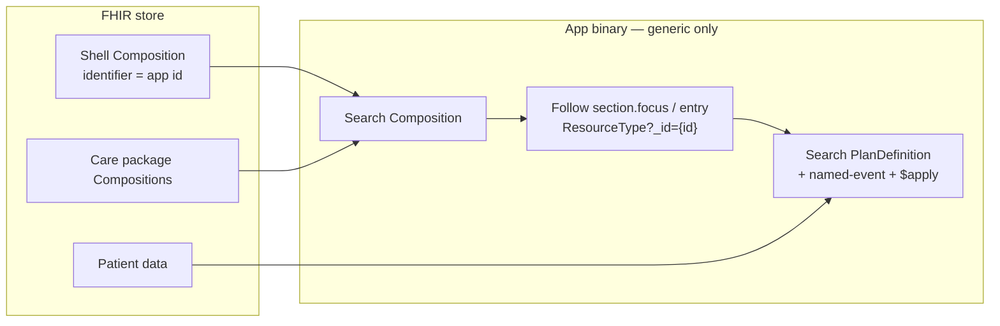

Questionnaires, PlanDefinitions, Libraries, and StructureMaps are **not** discovered with `Questionnaire?_tag=` / `PlanDefinition?_tag=`. They are listed on a Composition. The app searches Compositions, then fetches each linked id.

---

## 2. The two searches

Two searches, two times, two questions. Both read the store. Neither hardcodes a catalog.

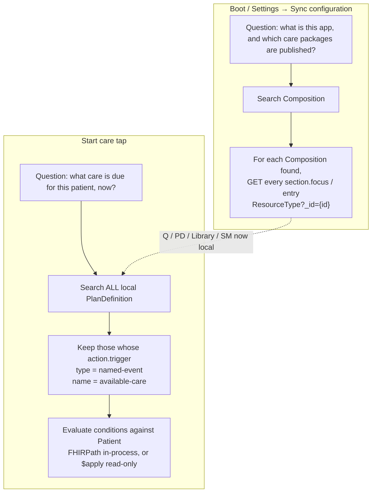

---

## 3. Search Composition

A Composition is a manifest: `section.focus` and `section.entry` are FHIR references. The app never guesses resource ids. It **searches Composition**, then walks those links.

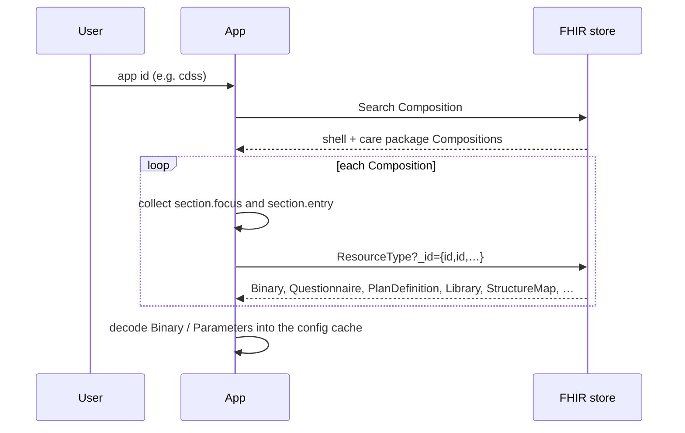

### 3.1 Shell vs care package

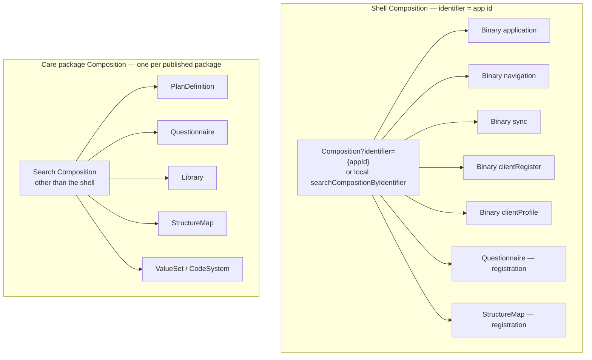

| Composition | Role | Typical `section` links |
|-------------|------|-------------------------|
| **Shell** | How the app behaves | Binary (application, navigation, register, profile, sync); the registration Questionnaire + StructureMap |
| **Care package** | One published unit of care | The PlanDefinition(s), Questionnaire(s), Library, StructureMap, ValueSet that package needs |

The shell must not be the pin-list of every clinical form. A care package must not reuse the shell's `identifier` (that search is `entryFirstRep` — last write would wipe navigation).

Whatever *is* on a Composition is downloaded **by id**:

```text
Search Composition
  then, for each section.focus / entry whose type is in FILTER_RESOURCE_LIST:
    Questionnaire?_id=…
    PlanDefinition?_id=…
    StructureMap?_id=…
    Library?_id=…
    Binary?_id=…
    Parameters?_id=…
```

A Questionnaire that is not referenced from any Composition the search returned is not fetched on this path.

### 3.2 Resource shape

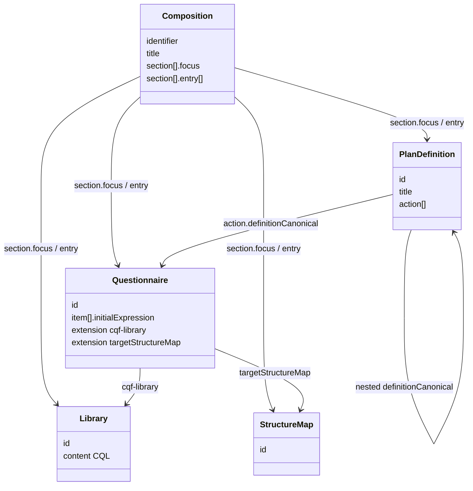

The Composition says *what belongs to the package*. The PlanDefinition says *when it is due* and *which Questionnaire to open*.

---

## 4. Search PlanDefinition — Start care

The register / profile button is empty of IDs:

```json
{
  "trigger": "ON_CLICK",
  "workflow": "APPLY_NAMED_EVENT",
  "display": "Start care",
  "params": [
    { "paramType": "PARAMDATA", "key": "namedEvent", "value": "available-care" },
    { "paramType": "RESOURCE_ID", "key": "subjectId", "value": "@{patientLogicalId}" }
  ]
}
```

The app knows `APPLY_NAMED_EVENT` and the string `available-care`. It does not know any package name or Questionnaire id.

### 4.1 Discover

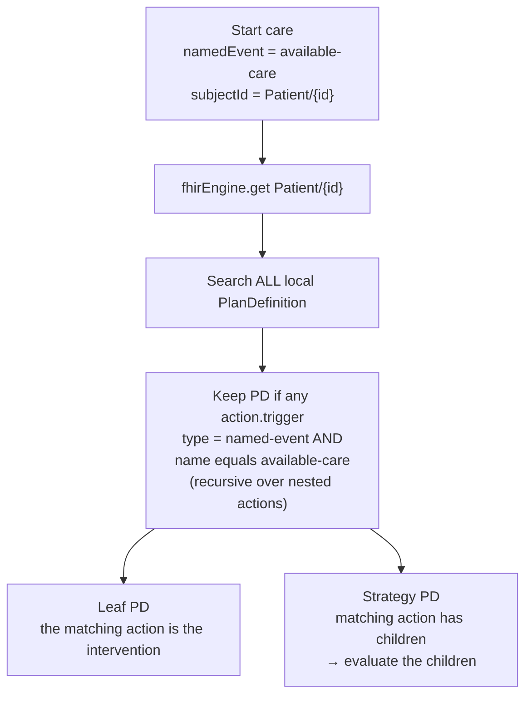

There is no config index of PD ids. A PlanDefinition that arrived via a care package Composition and carries the named-event is discoverable. One that does not, is not.

### 4.2 Action contract

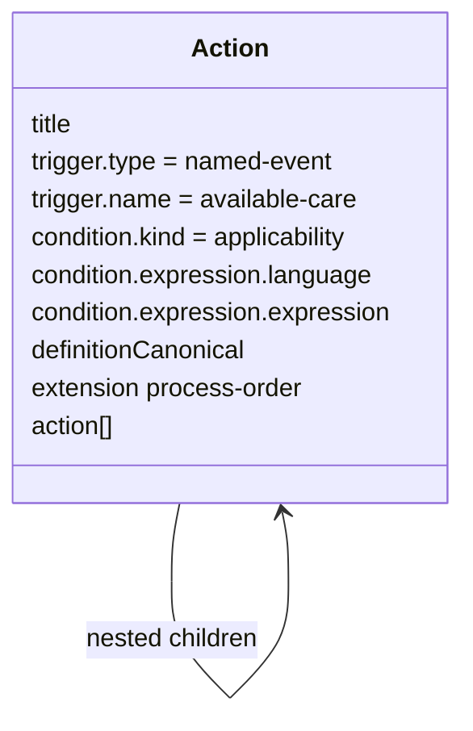

`definitionCanonical` on a **due-now** action must point at a Questionnaire. Nested PlanDefinition is followed one level to find a Questionnaire. Task / ActivityDefinition is reserved for later planning, not this Start care path.

### 4.3 Evaluate applicability

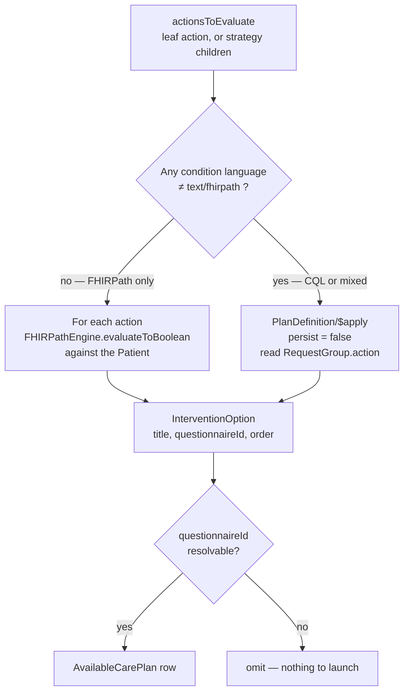

`$apply` on this path is a **browse**. It must not write Task / RequestGroup / CarePlan just because the worker opened the picker. Real CarePlan generation elsewhere still persists.

### 4.4 Pick and run, in content order

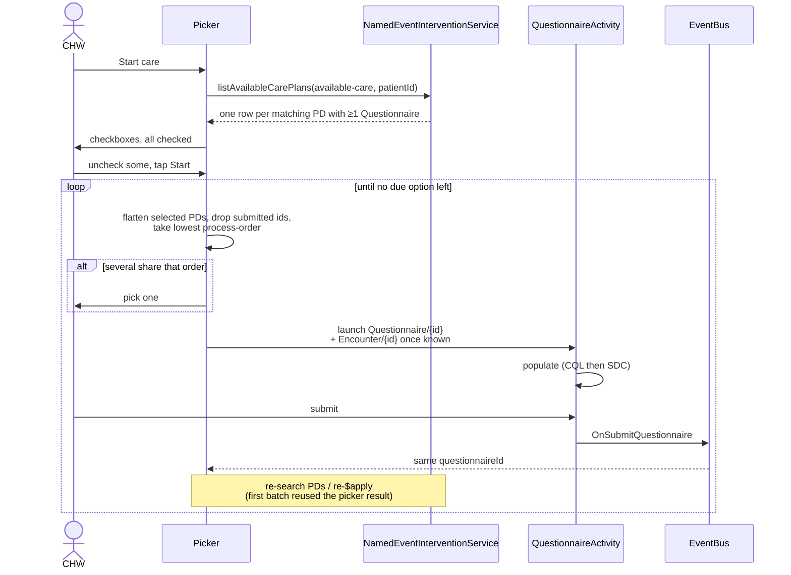

Order comes from a **process-order** extension on the action (integer 10, 20, 30, …), so it is comparable across the several PlanDefinitions the worker checked. It is not “whatever the dialog listed.”

Re-`$apply` after each submit is what makes the sequence data-driven: submitting one form can unlock a lower-order action on another selected PD. Until packages emit real applicability conditions, already-submitted questionnaire ids are suppressed client-side so the same form is not offered again in the same session.

---

## 5. End-to-end: from store to form

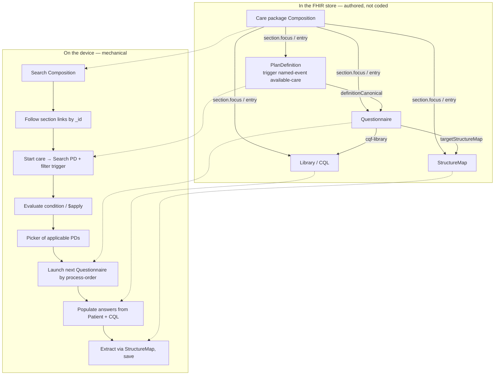

Change a condition on a PlanDefinition, publish the care package, sync. The next tap uses the new rule. The Kotlin that ran the search is unchanged.

---

## 6. Mentioned only: Populate, All clients

These are not the catalog. They are what make a store-driven catalog usable.

**Populate.** Once a Questionnaire id has been *discovered* from a PD, opening it is generic. CQL `initialExpression` items (linked via `cqf-library`) are evaluated against the launch-context Patient / Encounter **before** SDC `ResourceMapper.populate`. FHIRPath `initialExpression` stays on the SDC path. Defaults live on the Questionnaire and Library in the store, not in register JSON. After submit, the `targetStructureMap` canonical is resolved to a **local** `StructureMap/{id}` — also store content, usually linked from the same care package Composition.

**All clients.** One Patient register replaces siloed child / ANC / household registers. Family is RelatedPerson on the profile (`patient` = child, `identifier` = parent Patient URL). That is the subject Start care evaluates. It is not how interventions are listed.

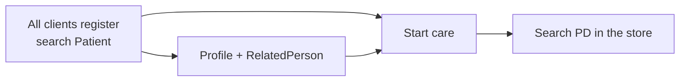

---

## 7. What is allowed to be "known" where

| Layer | May know | Must not know |
|-------|----------|---------------|
| App binary | How to **search Composition** and follow `section` links; workflow `APPLY_NAMED_EVENT`; how to **search PD**, `$apply`, and populate | Intervention ids, form ids, eligibility expressions, who authored the package |
| Shell Composition + Binaries | App id, nav, All-clients register, Start care **named event**, registration Q/SM **by id** | The list of clinical PlanDefinitions / Questionnaires |
| Care package Composition | The resources of that one package, via `section` links | Anything about Android screens |
| Patient store | Who the client is, what has already been recorded | Which programs the APK was built for |

**Success test:** publish a new care package Composition that links an `available-care` PlanDefinition and its Questionnaire. Sync the device. Matching clients see the new row on Start care. There is no app release and no edit to the shell Composition.
